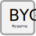

.. _bygging:

Bygging 
===============

Skilgreining
------------

.. admonition:: Skilgreining
    
  Bygging er mannvirki með nýtanlegt rými
   
Hlutverk
--------
  Að varðveita upplýsingar um bygginguna t.d. byggingarefni og byggingarár. Varðveita upplýsingar um hönnuði byggingarinnar og ábyrgðar og framkvæmdaaðila. Einnig að varðveita upplýsingar um úttektir og stöðuskoðanir á byggingartíma ásamt viðhaldssögu.  

Eigindi
-------
.. toctree::
   :maxdepth: 5

   eigindi/bygging_audkenni.rst
   eigindi/byggingarform.rst
   eigindi/botnplata_ummal.rst
   eigindi/botnplata_flatarmal.rst
   eigindi/utveggir_flatarmal.rst
   eigindi/veggop_flatarmal.rst
   eigindi/thak_flatarmal.rst
   eigindi/thakop_flatarmal.rst
   eigindi/berandiplata_flatarmal.rst

    

Vensl
-----

.. toctree::
   :maxdepth: 5

   vensl/byggingarafangi.rst
