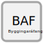

.. _byggingarafangi:

Byggingaráfangi
=================

.. admonition:: Skilgreining
    :class: skilgreining
    
    Byggingaráfangi er hluti byggingar eða heil bygging sem byggður er í  einum  áfanga.
    
Hlutverk
---------

Hlutverk byggingaráfanga er að geyma upplýsingar um einstaka byggingaráfanga byggingar

Eigindi
--------

Byggingaráfangi er Mannvirkishluti og ber því öll :ref:`eigindi mannvirkishluta<mannvirkishluti_eigindi>`.

.. toctree::
   :maxdepth: 5

   eigindi/byggingarafangi_nr.rst
   eigindi/brutto_rummal.rst
   eigindi/byggingarstig_fl.rst
   eigindi/byggingarar.rst
   eigindi/milliflotur_flatarmal.rst
   eigindi/botnflotur_flatarmal.rst
   eigindi/bruttoflotur_flatarmal.rst
   eigindi/skiptarummal.rst
   eigindi/virki_rummal.rst
   eigindi/hjupflotur.rst

Vensl 
------

.. toctree::
   :maxdepth: 5
   
   vensl/mannvirkishluti.rst
   vensl/bygging.rst
   
   

