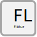

.. _flotur:

Flötur
======

.. admonition:: Skilgreining
    :class: skilgreining
    
    Flötur er mannvirkishluti af tegundinni flatt mannvirki
    
Hlutverk
--------

  Tilgangur flatar er að standa fyrir skráningu mannvirkishluta sem eru flöt virki og skráningu rúmmáls er ekki krafist.
    
Eigindi flatar
-------------------

Flatarmál
~~~~~~~~~~~~~~~~~~~~
  
.. admonition:: Skilgreining
 Flatarmál flatar er raunflötur hans

:Skýring:
 Dæmi um fleti eru bílaplön, kornrækt, skógrækt og önnur mannvirki sem heppilegt er að skrá sem flöt.
  
:Tækniheiti:
 Flotur
 
:Stuttheiti:
 FLT
 
:Gagnatýpa:
 Flatarmál flatar er rauntala stærri en 0
 
:Uppruni:
 ..todo:: 
    Hver er uppruni þessarra gagna ? Hvaða stjórnvald viðheldur þessarri skráningu ? Eru fleiri en eitt stjórnvald sem hafa skrá fleti ? Þarf að skilgreina mismunandi tegundir af flötum ? T.d bílaplön, geymslusvæði, kornrækt, skógrækt, verndarsvæði ?
 
:Birtingarform:  
 0,00 m2

Vensl flatar
--------------------

Flötur er mannvirkishluti
