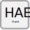

.. _haed:

Hæð
====

.. admonition:: Skilgreining
    
  :ref:`Byggingaráfangi<byggingarafangi>` skiptist í hæðir um hæðarskil. 

Skýring
----------------
  Hæðarskil eru í botnfleti og lokfleti hverrar hæðar. 
  Neðstu hæðarskil eru í yfirborði botnplötu byggingar og efstu hæðarskil eru í þakfleti eða botnfleti fylgirýmis eða afgangsrýmis.
  |br| Botnflötur er óslitinn flötur sem liggur í gólfyfirborði og framlengist yfir göt og gegnum fasta innveggi og útveggi. Botnflötur hæðar hefur ekki alltaf allur sömu hæðarlegu. Hann getur t.d. stallast í hæðum og tengst saman með lóðréttum eða hallandi flötum sem tilheyra botnfletinum. Liggi stigi í botnfleti hæðar, t.d. stigi steyptur á fyllingu, eru hæðarskil í kverkfleti hans. Er þá stærð stigans innifalin í botnfletinum. Í þessu tilfelli liggur stiginn í hæðarskilum og er hluti þeirra en hefur ekki legu milli hæðarskila. Algengasta afmörkun botnflatar er útbrún útveggja. Flatarmál botnflatar hæðar er flatarmál lóðrétts ofanvarps hans á láréttan flöt.
  |br| Um uppskiptingu mannvirkis í hæðir gildir eftirfarandi:

	1.	Byggingu skal skipt í hæðir neðan frá og upp úr.
	2.	Hver hæð skal merkt með hæðanúmeri. Númering kjallara er 00 og síðan -1 og -2 ef kjallarar eru fleiri. Fyrsta hæð er merkt 01, önnur hæð 02, o.s.frv.
	3.	Hverja hæð skal merkja með heiti, t.d. kjallari, 1. hæð, sem er að jafnaði jarðhæð, 2. hæð o.s.frv.
	4.	Kjallari telst þegar gólf er undir yfirborði jarðvegs á alla vegu, sbr. byggingarreglugerð.
    
Eigindi 
--------------

.. toctree::
   :maxdepth: 5

   eigindi/haed_nr.rst
   eigindi/lysing.rst
   eigindi/flokkun.rst
   eigindi/botn_flatarmal.rst
   eigindi/milliflotur_flatarmal.rst
   eigindi/bruttoflotur.rst
   eigindi/bruttorummal.rst
  
Vensl
----------------

.. toctree::
   :maxdepth: 5

   vensl/byggingarafangi.rst
   vensl/rymi.rst
