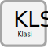

.. _klasi:

Klasi
==================================

Skilgreining
------------

.. admonition:: Skilgreining
    :class: skilgreining
    
    Klasi er afmörkun í byggingum sem myndar reikningslega heild til grundvallar eignarskiptaútreikninga.
    |br| Klasi myndast þegar rekstrareiningar í mismunandi byggingum tengjast saman í eina notkunareiningu. 
    |br| Þegar klasi myndast í byggingu sem samanstendur af byggingaráföngum á fleiri en einni landeign þá nær klasinn einungis til þeirra byggingaráfanga sem eru innan þeirrar landeignar sem byggingaráfangar klasans standa á.
    
   
Hlutverk
--------
  Hlutverk klasa er að afmarka þá byggingaráfanga sem hafa eignatengingar sín á milli sem krefjast þess að eignarhlutfall í þeim sé reiknaði sem hlutfall af einni heild.
 
Eigindi
-------------
 
.. toctree::
   :maxdepth: 5
   
   eigindi/klasi_nr.rst
      
Vensl
-----

.. toctree::
   :maxdepth: 5
   
   vensl/byggingarafangi.rst
