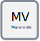

.. _mannvirki:

Mannvirki 
==========

  
Skilgreining
----------------
.. admonition:: Skilgreining
    :class: skilgreining
   
   Mannvirki er hverskonar jarðföst [#]_ manngerð framkvæmd

Nánar skilgreint í 51. tölul. 1.2.1. gr. byggingarreglugerðar [#]_

.. admonition:: Skilgreining
    :class: skilgreining
    
    „Hvers konar jarðföst, manngerð smíð, svo sem hús og aðrar byggingar eða skýli, virkjanir, dreifi- og flutningskerfi rafveitna, hitaveitna, vatnsveitna og fjarskipta, fráveitu­mannvirki, umferðar- og göngubrýr í þéttbýli, stór skilti og togbrautir til fólksflutninga. Til mannvirkja teljast einnig tímabundnar og lausar byggingar sem ætlaðar eru til svefns eða dag­legrar dvalar manna í fjóra mánuði eða lengur á sama stað, svo sem starfsmannabúðir og húsvagnar. Mannvirki á eða í hafi, vötnum og ám sem hafa fasta staðsetningu teljast einnig til mannvirkja samkvæmt reglugerð þessari.“

Hlutverk 
---------------

Mannvirki er andlag sem geymir sögu mannvirkis og samhengi þess við mannvirkishluta. Það tengir saman mannvirkishluta í eitt mannvirki og leyfir eðlilega umsýslu fasteignaréttinda í mannvirkjum sem ná yfir mörk landeigna, en mörk fasteignar eru bundin við mörk landeignar þrátt fyrir að mannvirki sé ekki bundið þeim mörkum.

Eigindi
----------------
.. toctree::
   :maxdepth: 5

   eigindi/mannvirki_nr.rst
       
Vensl 
--------------------

.. toctree::
   :maxdepth: 5

   vensl/mannvirkishluti.rst

  
Skýringar
---------
.. [#] Jarðföst í þeirri merkingu að vera varanlega skeytt við jörðina eða hafa staðið á jörðinni í tiltekinn tíma
.. [#] `[HMS] Hvað er mannvirki`_ 

.. _`[HMS] Hvað er mannvirki`: http://www.mannvirkjastofnun.is/byggingar/spurningar-og-svor-um-byggingamal/hvad-er-mannvirki/

  
