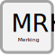

.. _merking:

Merking
==================================

Skilgreining
------------

.. admonition:: Skilgreining
    :class: skilgreining
    
    Merking er texti sem auðkennir og aðgreinir notkunareiningar sem tengjast sama staðfangi
    
Hlutverk
--------

Tilgangur merkingar er að hjálpa fólki að rata rétta leið að notkunareiningu og til að samræma skráningu merkinga sem notaðar eru í húsum.

Eigindi
----------------
.. toctree::
   :maxdepth: 5
   
   eigindi/merking_birtingarmynd.rst
 
  
Vensl
-----
.. toctree::
   :maxdepth: 5

   vensl/merking_rekstrareining.rst

