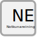

.. _notkunareining:

Notkunareining
===============

.. admonition:: Skilgreining

  Notkunareining er tiltekin starfsemi sem skipulags og byggingaryfirvöld hafa heimilað á landeign eða í byggingu.
  
Skýring
----------
  Notkunareining er starfsemi, eða notkun, sem skipulagsyfirvöld hafa heimilað á landeign og/eða í mannvirkjum. t.d íbúð, verslun, skrifstofa, torfærubraut eða náma.
  Notkunareiningar uppfylla allar kröfur til að geta staðið sem sjálfstæð fasteign en jafnframt geta margar notkunareiningar verið ein fasteign.
  

Eigindi
----------------
.. toctree::
   :maxdepth: 5
   
   eigindi/notkunareining_nr.rst
   eigindi/notkunarflokkur.rst
   eigindi/merking.rst
   eigindi/ist120flokkur.rst
  

Vensl
-----
.. toctree::
   :maxdepth: 5

   vensl/fasteign.rst
   vensl/rekstareining.rst
   
  

 

 

 

 
 
 
