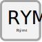

.. _rymi:

Rými
======

.. admonition:: Skilgreining

   Rými er afmarkað, samfellt rúmmál innan hæðar í byggingaráfanga að meðtöldu umliggjandi virki sem afmarkast af eignarskilum, höfuðflokkun, lokunarflokkun og notkun.

:Skýring:    
  Á uppdráttum er hverri hæð skipt í rými. Byrjað skal á neðstu hæð mannvirkis. 
     
Eigindi 
--------------

.. toctree::
   :maxdepth: 5

   eigindi/rymi_nr.rst
   eigindi/lysing.rst
   eigindi/lokunarflokkur.rst
   eigindi/hofudflokkur.rst
   eigindi/op_flatarmal.rst
   eigindi/bruttoflatarmal.rst
   eigindi/nettoflatarmal.rst
   eigindi/botnflatarmal.rst
   eigindi/milliflotur_flatarmal.rst
   eigindi/stigar_flatarmal.rst
   eigindi/birt_flatarmal.rst
   eigindi/salarhaed_min.rst
   eigindi/salarhaed_max.rst
   eigindi/bruttorummal.rst
   eigindi/skiptarummal.rst
   eigindi/reiknitala_skiptarummals.rst
 
Vensl
--------------

.. toctree::
   :maxdepth: 5

   vensl/rekstrareining.rst
   vensl/haed.rst
   vensl/byggingarafangi.rst
   vensl/mannvirki.rst
